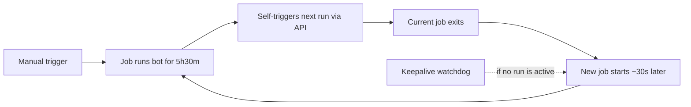

# Deploying XewaliChess Bot on Lichess

This guide covers deploying the Xewali chess engine as a 24/7 Lichess bot using **GitHub Actions** (free for public repos).

## Prerequisites

- A public GitHub repository with this code
- A [Lichess BOT account](https://lichess.org/api#tag/Bot)

## 1. Get a Lichess API Token

1. Log into lichess.org with your bot account.
2. Go to https://lichess.org/account/oauth/token/create
3. Select the `bot:play` scope. This is the only scope needed — it covers playing moves, accepting challenges, and chat.
4. Generate the token and save it.

> If your account is still a normal account, upgrade it to a BOT account first.
> This is a **one-time, irreversible** action and the account must not have played any games:
> ```bash
> curl -d '' https://lichess.org/api/bot/account/upgrade \
>   -H "Authorization: Bearer YOUR_TOKEN"
> ```

## 2. Set Up GitHub Secrets

Go to your repo → **Settings** → **Secrets and variables** → **Actions** → **New repository secret**.

Add these two secrets:

| Secret Name | Value | Purpose |
|---|---|---|
| `LICHESS_BOT_TOKEN` | `lip_xxxxxxxxxxxxxxxxxxxxxxxx` | Your Lichess API token so the bot can connect |
| `BOT_RUNNER_PAT` | `github_pat_xxxxxxxxxxxxxxxxx` | A GitHub PAT that lets the bot re-trigger itself before the 6h timeout |

### Creating the PAT (`BOT_RUNNER_PAT`)

1. Go to https://github.com/settings/tokens?type=beta → **Generate new token** (Fine-grained)
2. **Resource owner**: Your account
3. **Repository access**: Only select repositories → choose `XewaliChessRust`
4. **Permissions**: Under "Repository permissions", set **Actions** → **Read and write**
5. Generate and copy the token — you'll only see it once

> Why this is needed: GitHub Actions has a **6-hour hard limit** per job. The bot self-triggers a new workflow run before the timeout, creating a chain that keeps the bot online 24/7. A classic PAT with `workflow` scope also works.
>
> This same token powers the **Bot Keepalive Watchdog** (`keepalive.yml`), so keep it valid: set a long expiry or renew it before it lapses — an expired PAT is the most common way the bot goes offline.

## 3. Start the Bot

Go to your repo → **Actions** → **Run Lichess Bot** → **Run workflow** → **Run workflow**.

The first run will:
- Pull the pre-built Docker image from GHCR
- Start the bot, which connects to Lichess

After ~5h30m, the bot automatically triggers the next run and exits cleanly. The new run picks up within ~30 seconds. This repeats indefinitely.

Three layers keep it online:

1. **In-container supervisor** — if `lichess-bot.py` crashes, `entrypoint.sh` restarts it within seconds (5s, backing off to 25s). Recovery is immediate rather than waiting on the watchdog. After 5 consecutive attempts that fail to stay up for a minute, it gives up on purpose so the job fails and layer 3 starts a fresh run on a freshly pulled image.
2. **Self-trigger handoff** — the run dispatches its successor at 5h30m and retries until the API accepts it.
3. **Keepalive watchdog** — a scheduled check every 20 minutes, described below.

## 4. Verify the Bot is Online

1. Check the Actions tab — you should see a green "Run Lichess Bot" workflow running.
2. Go to `https://lichess.org/@/YOUR_BOT_USERNAME` — it should show as online (green dot).
3. Challenge it to a game to confirm it plays.

To view live logs, open the running workflow and click on the `run-bot` job → expand "Run the bot".

## 5. How It Works



**Keepalive watchdog** — `keepalive.yml` runs on a schedule every 20 minutes and makes two checks:

1. **Is a `run-bot.yml` run active?** If no run is queued or in progress, it dispatches one. This recovers from a broken handoff chain.
2. **Is the bot actually online on Lichess?** A run can sit in `in_progress` while the bot inside it has silently dropped its event stream — the run-status check alone would not notice for up to 6 hours. So the watchdog resolves the bot's username via `/api/account` and checks `/api/users/status`. If the bot is offline while a run has been in progress for more than 10 minutes, that run is cancelled and replaced.

The 10-minute grace period matters: it keeps the watchdog from cancelling a run that is merely pulling its image or mid-handoff. If Lichess is unreachable, the watchdog leaves the active run alone rather than acting on a missing answer.

It is a separate workflow on purpose: a `schedule` trigger on `run-bot.yml` itself would queue a new 6-hour run on every cron tick even while the bot is healthy.

> **Note:** GitHub disables scheduled workflows in public repos after **60 days without repository activity**. If you go two months without pushing a commit, the watchdog stops firing and you'll need to re-enable it from the Actions tab. The self-trigger chain is unaffected.

### Limitations

| Issue | Impact |
|---|---|
| **Games interrupted at handoff** | Any game in progress when the 6h handoff occurs will be abandoned (bot resigns on timeout). This happens ~every 6 hours. |
| **~30s offline gap** | During the handoff, the bot appears offline on Lichess. No challenges are accepted. |
| **PAT expiry** | Fine-grained PATs can expire (you set the expiry when creating). If it expires, the chain breaks — and the watchdog can't help either, since it uses the same token. The watchdog fails loudly with a clear error in this case. Renew the PAT and manually re-trigger. |
| **Chain breakage** | The bot retries the self-trigger until it succeeds. If the chain still breaks, the keepalive watchdog restarts the bot within ~20 minutes. |
| **Wedged bot** | Detected via the Lichess online check and replaced within ~20–30 minutes. |
| **Cron drift** | GitHub's scheduled runs are best-effort and can be delayed under load, so "every 20 minutes" is a floor, not a guarantee. |

### If you need truly uninterrupted 24/7

For zero-downtime operation without the 6h handoff, deploy on a free-tier cloud VM instead:

- **Oracle Cloud** — Always Free tier includes an ARM VM (4 cores, 24 GB RAM)
- **Google Cloud** — Free tier includes a micro VM
- **fly.io** — Free tier includes 3 shared-cpu VMs

For VPS deployment, see the [VPS Deployment section](#vps-deployment-alternative) below.

## 6. Updating the Bot

Push your changes to `main`. The `Build and Push Docker Image` workflow will build and push a new Docker image to GHCR.

The running bot picks up the update automatically on the next handoff (within 6 hours). For immediate update, cancel the running workflow and manually trigger a new one.

## Configuration

Edit `config.yml` to adjust bot behavior. Key settings:

| Setting | Default | Description |
|---|---|---|
| `challenge.concurrency` | `1` | Number of simultaneous games |
| `challenge.time_controls` | bullet, blitz, rapid | Accepted time controls |
| `challenge.variants` | standard | Accepted variants (add `chess960` for Chess960) |
| `challenge.modes` | casual, rated | Accepted game modes |
| `challenge.accept_bot` | `false` | Accept challenges from other bots |
| `challenge.min_base` | `30` | Minimum initial time (seconds) |
| `challenge.max_base` | `10800` | Maximum initial time (seconds) |
| `challenge.min_increment` | `0` | Minimum increment (seconds) |
| `challenge.max_increment` | `180` | Maximum increment (seconds) |

See the [lichess-bot configuration docs](https://github.com/lichess-bot-devs/lichess-bot/wiki/Configure-lichess-bot) for the full list of options.

---

## VPS Deployment (Alternative)

If you have a VPS, this is the preferred method — no 6h handoff, no game interruptions.

### Prerequisites

- A VPS with Docker and Docker Compose installed

### Steps

Clone the repo and configure:

```bash
git clone https://github.com/hsaikia/XewaliChessRust.git
cd XewaliChessRust
cp .env.example .env
```

Edit `.env` and paste your token:

```
LICHESS_BOT_TOKEN=lip_xxxxxxxxxxxxxxxxxxxxxxxx
```

Pull and run:

```bash
docker compose pull
docker compose up -d
```

Verify the bot is connected:

```bash
docker compose logs -f
```

### Managing the Bot (VPS)

| Action | Command |
|---|---|
| Start | `docker compose up -d` |
| Stop | `docker compose down` |
| View live logs | `docker compose logs -f` |
| Restart | `docker compose restart` |
| Update to latest image | `docker compose pull && docker compose up -d` |

The `restart: unless-stopped` policy ensures the bot automatically restarts after crashes or VPS reboots.
